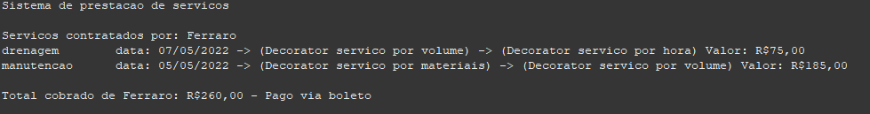

## Sistema de prestação de serviços com decorator Pattern

A atividade foi desenvolvida como parte da disciplina de design patterns.

## Conteúdo
O objetivo foi desenvolver uma aplicação em console que realiza o gerenciamento e agendamento de serviços prestados pela empresa fictícia Coisas&Coisas.

A empresa Coisas&Coisas presta diversos serviços, esses serviços podem ser cobrados por tempo decorrido, volume extraido do local, materiais gastos para reparo, etc. Assim, para evitar a explosão de classes decorrente de serviços com diferentes comportamentos (o que ocorreria se fosse usado somente a herança), foi utilizado o pattern decorator, assim é possível adicionar ao serviço prestado os comportamentos desejados, sem ter que aumentar de forma exponencial a quantidade de classes.

## Screenshot do resultado do terminal

## Diagrama UML

